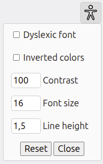

# access-settings
Web component for accessibility settings

## Demo
https://yannickbochatay.github.io/access-settings/example



## Installation

### From CDN
The fastest and simplest way to get started.

```html
<!DOCTYPE html>
<html lang="fr">
  <head>
    <meta charset="UTF-8">
    <title>My accessible page</title>
    <script src="https://cdn.jsdelivr.net/npm/access-settings"></script>
  </head>
  <body>
    <access-settings all></access-settings>
  </body>
</html>
```

### NPM
```sh
npm install access-settings
```
```html
<script src="node_modules/access-settings/dist/index.js"></script>
```

### Direct download

You can download the [file directly from GitHub](https://raw.githubusercontent.com/YannickBochatay/access-settings/refs/heads/main/dist/index.js).


## Usage

### Attributes
#### all
To display all the options, add the `all` attribute. Otherwise add specific options to display.
```html
<access-settings all>
</access-settings>
```
```html
<access-settings dyslexic-font invert-colors font-size line-height>
</access-settings>
```

#### side
By default, the component has a fixed position at the right of the screen. The drop-down menu will align to the right with the icon. To position it on the left, use the ‘side’ attribute. 
```html
<access-settings side="left">
</access-settings>
```

#### rounded
To display the icon in a circle, use `rounded` attribute.
```html
<access-settings all rounded>
</access-settings>
```

#### lang
Component labels are based on `lang` attribute in the html tag. Languages available are english (**en**) and french (**fr**). Customisation is coming.

## Customisation

### Position
Customise the position of the component in CSS
```css
accessibility-settings {
  position:absolute;
  top:5px;
  right:5px;
}
```
Define `left` css property if the attribute `side` is set to left.

### Icon style
```css
access-settings::part(icon) {
  background-color: brown;
  fill:white;
}
```

### Change icon
```html
<access-settings all>
  <span slot="icon">⚙︎</span>
</access-settings>
```

### Add more options
```html
<access-settings all>
  <div slot="option">
    <label>
      <input type="checkbox">
      One more option
    </label>
  </div>
  <div slot="option">
    <label>
      <input type="checkbox"/>
      Another option
    </label>
  </div>
</access-settings>
```
Of course you'll have to write some javascript to make these new options work.

Why not a web component ? It could look like this :
```html
<access-settings all>
  <access-more-option1 slot="option"/>
  <access-more-option2 slot="option"/>
</access-settings>
```