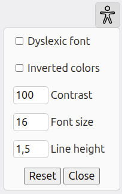

# access-settings
access-settings is a standalone web component that makes it easy to add accessibility options to your website.



## Installation

### From CDN
The fastest and simplest way to get started.

```html
<!DOCTYPE html>
<html lang="fr">
  <head>
    <meta charset="UTF-8">
    <title>My accessible page</title>
    <script src="https://cdn.jsdelivr.net/npm/access-settings@1" type="module"></script>
  </head>
  <body>
    <access-settings all></access-settings>
  </body>
</html>
```

### NPM
```sh
npm install access-settings
```
```html
<script src="node_modules/access-settings/dist/index.js" type="module"></script>
```

## Demo and full documentation
[English version](https://yannickbochatay.github.io/access-settings/doc?lang=en)

[French version](https://yannickbochatay.github.io/access-settings/doc?lang=fr)